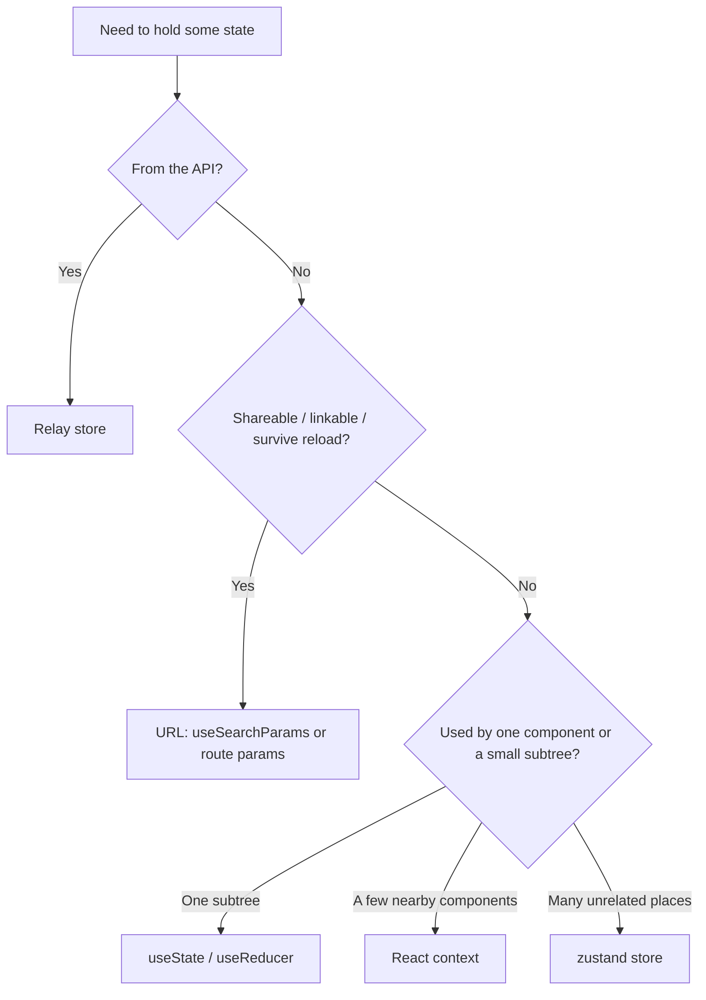

# Client state management

Probo frontends have several places state can live. Choosing the wrong one is the most common source of avoidable complexity: data drilled through props, local state that should have been in the URL, or a global store holding what is really server data. This guide is a **decision order** — start at the top and stop at the first option that fits.

## Related guides

| Topic | Guide |
|-------|--------|
| Server data (queries, fragments, mutations, store) | [`contrib/claude/relay.md`](relay.md) |
| URL/search params, navigation | [`contrib/claude/routing.md`](routing.md) |
| Props are configuration, not data | [`contrib/claude/react-components.md`](react-components.md#props-are-for-configuration-and-composition-not-data) |

## Decision order

1. **Server data → Relay.** Anything fetched from the API lives in the Relay store, read via `useFragment` / `usePreloadedQuery`, and mutated with `useMutation` that updates the store. Never copy server data into `useState` to "manage" it. (See [`relay.md`](relay.md).)
2. **Shareable / linkable / reload-surviving UI state → the URL.** Active tab, filters, sort, search query, pagination cursor, selected id in a master-detail view. Use `useSearchParams` / route params (see [`routing.md`](routing.md)). If a teammate should be able to paste the link and see the same view, it belongs here.
3. **Local component state → `useState` / `useReducer`.** Ephemeral, view-only state scoped to one component or a small subtree: an input's draft value, whether a menu is open, a hover flag. Keep it as local as possible.
4. **Shared ephemeral state across a subtree → React context.** When a handful of nearby components need the same ephemeral state and lifting to a common parent is clean (e.g. a wizard step, a selection set within a list). Context carries the state + setters; it does **not** carry server data.
5. **App-wide ephemeral client state → `zustand`.** Only for genuinely global, non-server, non-URL state that many unrelated parts of the app read/write: theme / dark-mode preference, a command palette, global toasts. Reach for it last.



## Do / don't

### Server data stays in Relay

```tsx
// Bad — copying fetched data into local state to "edit" it
const data = usePreloadedQuery(query, queryRef);
const [measures, setMeasures] = useState(data.measures);

// Good — read from Relay; mutate through useMutation (store updates flow back)
const data = usePreloadedQuery(query, queryRef);
```

### Tab / filter belong in the URL

```tsx
// Bad — active tab in local state; lost on reload, not linkable
const [tab, setTab] = useState<"open" | "closed">("open");

// Good — tab in the URL
const [params, setParams] = useSearchParams();
const tab = params.get("tab") ?? "open";
```

### Don't reach for a global store by default

```tsx
// Bad — a zustand store for state two sibling components share
useFilterStore();   // global singleton for a local concern

// Good — lift to the nearest common parent (state + context if the tree is deep)
```

`zustand` is available (it's a `@probo/ui` dependency) — use it deliberately for app-wide ephemeral state, not as a shortcut around prop-passing or the URL.

## Anti-patterns to avoid

- **Prop-drilling data** that a child could read from Relay (`useFragment`) or the router (`useParams`) itself.
- **Mirroring** a controlled value (e.g. a dialog's `open`, a fragment field) into `useState` + `useEffect` to keep them in sync — pass the source through instead.
- **Global store as a cache** for server data — that's Relay's job.
- **Outlet context for domain data** — forbidden; see [`routing.md`](routing.md).
