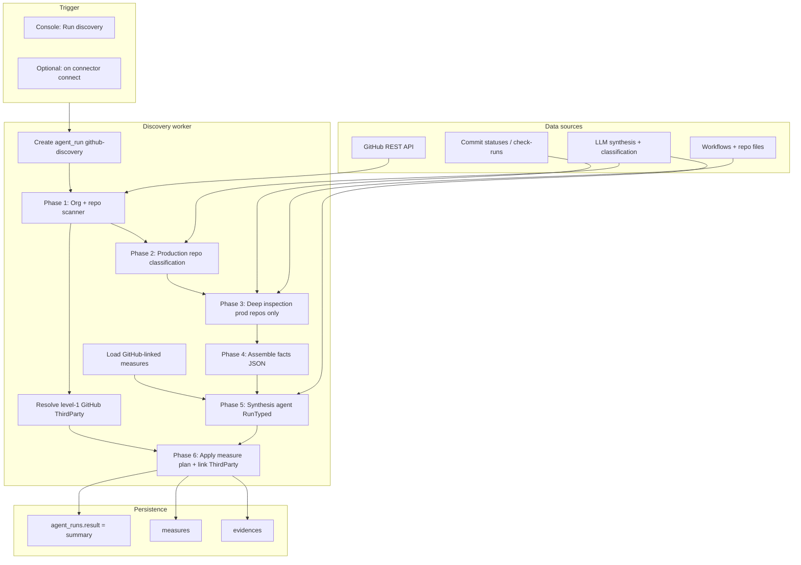

# GitHub integration discovery — plan

Status: **draft for review** (not yet approved for implementation)

This document consolidates planning discussions for Probo’s first **integration
agent** capability, scoped to **GitHub discovery**. Gap analysis against
frameworks is described at a high level but **out of scope** for the first
implementation PR.

---

## 1. Executive summary

Probo customers often start with an **empty GRC program**. We connect their
GitHub organization, **discover what security and engineering practices are
already in place**, and materialize a **framework-agnostic posture map** as
**measures + evidence** in Probo.

Discovery is **read-only** (auditor, never remediator). Findings and framework
gap analysis come in a **later phase** with a dedicated gap agent.

The technical approach is **hybrid**:

- **Deterministic scanner** collects exhaustive facts: org settings, API
  responses, lockfiles, commit signatures, file existence, workflow parsing,
  and commit-status-based CI detection (including external CI such as
  CircleCI, Jenkins, and Drone).
- **Synthesis agent (LLM)** materializes the posture map: given facts plus
  existing org measures, it decides which measures to **update** vs **create**,
  writes evidence narratives, and applies judgment (production repo context,
  de-facto vs enforced, `NOT_APPLICABLE` with justification).

There is **no `practice_id`** on measures. Re-discovery deduplication is
semantic: the synthesis agent matches new facts to existing `measure_id`
values instead of relying on a rigid catalog key in the database.

We **do not** add `integration_assessment_runs` or
`integration_posture_snapshots` tables. We reuse **`agent_runs`** for run
history and **`measures` + `evidence`** as the source of truth for posture.

---

## 2. Goals

| Goal | Description |
|------|-------------|
| Bootstrap empty orgs | First connect → populated measure map from reality |
| Framework-agnostic | Discovery does not reference ISO/SOC 2 |
| Low false positives | Prefer `UNKNOWN` / `NOT_APPLICABLE` over guessing |
| Flexible, not rigid | Separate enforced vs in-practice vs documented guidance |
| Compliance manager UX | Console-first; not IDE/skill-first |
| Read-only forever | No auto-fix, no branch protection changes |
| Extensible | GitHub first; schema supports future integrations |
| Third-party linkage | Every discovery measure links to org **level-1 GitHub** `ThirdParty` |

---

## 3. Locked decisions

| Topic | Decision |
|-------|----------|
| Primary user | Compliance manager in Console |
| Policy model | **Option B** — measures first, no control linkage until gap phase |
| Discovery output | Auto-apply measures + evidence (**no preview gate**) |
| Gap agent | Separate agent, later PR; auto-creates findings |
| Access review | **Separate** workflow; same connector credentials OK |
| Enterprise | Audit log + GHAS in v1 with graceful degradation |
| Remediation | Read-only auditor, permanently |
| Persistence | `agent_runs` + `measures` + `evidence`; no snapshot table |
| Measure identity | **No `practice_id`** — LLM resolves to existing `measure_id` on re-run |
| Agent vs scanner | **Hybrid** — scanner collects facts; synthesis agent materializes measures |
| Third-party linkage | All discovery measures → `measures_third_parties` → level-1 GitHub `ThirdParty` |

---

## 4. Product flow

### 4.1 Phase 1 — Discovery (this PR)

```text
Empty org
  → Connect GitHub (existing connector)
  → Run discovery (new)
  → Resolve level-1 GitHub ThirdParty (create if missing)
  → Measures + evidence auto-created, each linked to GitHub ThirdParty
```

### 4.2 Phase 2 — Gap analysis (later)

```text
Posture map (measures + evidence)
  → User selects framework (e.g. ISO 27001:2022)
  → Gap agent compares framework controls to measures
  → Findings auto-created + controls_measures links
```

### 4.3 Console UX (discovery)

```text
Integrations → GitHub (connected)

  [Run discovery]          Last run: …

  ── Posture summary ──
  42 repos · 12 measures · 8 implemented · 3 gaps · 1 unknown

  ── Measures (from discovery) ──
  Org-wide MFA enforcement          NOT_IMPLEMENTED
  CI present on production repos    IMPLEMENTED
  Dependency automation configured  IMPLEMENTED
  …
```

---

## 5. Architecture

### 5.1 Pipeline



### 5.2 Evaluation modes

| Mode | Use when | False-positive risk |
|------|----------|---------------------|
| `API` | Objective org/repo settings | Very low |
| `STATUS` | External CI (CircleCI, Jenkins, Drone, …) via commit statuses / check-runs | Low |
| `PARSE` | Workflows, lockfiles, doc paths, Dependabot/Renovate config | Low |
| `STATS` | Rates over commits/PRs (signed %, convention match %, approval %) | Low–medium |
| `AGENT` | Production classification, ambiguous CI, doc quality | Medium — confidence-gated |

**Global CI rule:** never infer CI from workflows alone. Always check:

1. `.github/workflows/`
2. `GET /repos/{r}/commits/{sha}/status`
3. `GET /repos/{r}/commits/{sha}/check-runs`

### 5.3 Three-layer pattern (enforced / practice / guidance)

Many practices exist in three forms:

| Layer | Example |
|-------|---------|
| **Enforced** | Branch protection requires signed commits |
| **In practice** | 94% of commits are actually signed |
| **Guidance** | `CONTRIBUTING.md` documents signing policy |

Keep these as **separate measures** to avoid false positives and to support
nuanced audits (e.g. PR review not enforced but done de-facto).

### 5.4 Agent boundaries

| Component | LLM? |
|-----------|------|
| Org scanner | No |
| Repo API scanner | No |
| Workflow parser | No |
| Commit status detector | No |
| Lockfile / doc existence checks | No |
| Production repo classifier | Yes (with heuristic pre-filter) |
| **Measure synthesis** | **Yes (core)** — facts + existing measures → measure plan |
| De-facto PR review interpretation | Yes (part of synthesis or pre-synthesis facts) |
| Doc completeness quality | Yes (part of synthesis) |
| Gap agent (later) | Yes |

The synthesis agent receives **pre-fetched facts** and does not roam GitHub
with tools. Use `RunTyped` with a structured `MeasurePlan` output schema.

### 5.5 Synthesis agent (measure materialization)

**Input:**

- `facts[]` — deterministic scan output (see §6.6)
- `existing_measures[]` — measures **already linked to this GitHub ThirdParty**
  via `measures_third_parties` (`id`, `name`, `description`, `state`, `category`)
- `github_third_party` — level-1 vendor record (name, id)
- `check_catalog` — advisory hints (coverage areas, not DB keys)

**Output (`MeasurePlan`):**

```json
{
  "updates": [
    {
      "measure_id": "gid://...",
      "state": "NOT_IMPLEMENTED",
      "evidence_summary": "Org does not require 2FA; 3 members lack 2FA.",
      "fact_refs": ["f-001", "f-002"]
    }
  ],
  "creates": [
    {
      "name": "Org-wide MFA enforcement",
      "description": "All organization members must use two-factor authentication.",
      "category": "access",
      "state": "NOT_IMPLEMENTED",
      "evidence_summary": "...",
      "fact_refs": ["f-001"]
    }
  ],
  "unchanged": [
    { "measure_id": "gid://...", "reason": "No new facts affect this measure." }
  ]
}
```

**Guardrails (auto-apply without preview):**

- Every `state` change must cite one or more `fact_refs` from the facts JSON.
- Prefer `updates` over `creates` when an existing **GitHub-linked** measure is
  semantically the same (re-discovery dedup).
- **Never update measures not linked to this GitHub ThirdParty** — avoids
  conflating GitHub posture with measures for Google Workspace, Okta, etc.
- Cap `creates` per run (e.g. ≤20) to prevent measure sprawl.
- Use `UNKNOWN` when cited facts are insufficient — do not guess.
- Do not rename measures on update; only `state`, `description`, and evidence
  may change.
- Separate enforced vs in-practice vs documented guidance into distinct
  measures when the distinction matters (see §5.3).

**Persist layer:** Go code applies `MeasurePlan` deterministically — creates
measures, updates states, appends evidence, and **upserts**
`measures_third_parties` for every created measure. The LLM does not write to
the DB.

---

## 6. Data model

### 6.1 Reuse existing entities

| Entity | Role |
|--------|------|
| `connectors` | OAuth/PAT credentials (existing) |
| `third_parties` | Level-1 **GitHub** vendor in org register (`level = 1`) |
| `measures_third_parties` | Links every discovery measure to GitHub ThirdParty |
| `agent_runs` | Run tracking; `start_agent_name = github-discovery`; summary in `result` |
| `measures` | Framework-agnostic posture map |
| `evidences` | Proof per measure (description + link to run/API) |
| `findings` | **Not created in discovery phase** |

### 6.2 No new tables for v1

| Rejected | Reason |
|----------|--------|
| `integration_assessment_runs` | Duplicates `agent_runs` |
| `integration_posture_snapshots` | Duplicates `measures` + `evidence` |

**Checkpoint vs result:** `agent_runs.checkpoint` is transient execution state
(cleared on completion). Posture lives in measures/evidence, not checkpoint.

### 6.3 Measure model — no schema change required for v1

Measures remain standard GRC entities. We **do not** add `practice_id` or
integration-specific columns for discovery v1.

| Field | Usage |
|-------|-------|
| `name` | Human-meaningful; chosen by synthesis agent on create |
| `description` | What the practice means for this org |
| `category` | e.g. `access`, `supply_chain`, `ci_cd` |
| `state` | `IMPLEMENTED` / `NOT_IMPLEMENTED` / `UNKNOWN` / `NOT_APPLICABLE` |
| `reference_id` | Existing auto-generated `MSR-xxx` (unchanged) |

**Re-discovery dedup:** synthesis agent returns `updates[].measure_id` for
existing measures. Persist layer updates by primary key — no catalog lookup.

**Optional later:** nullable `source` column (e.g. `GITHUB`) to filter
Console views. Not required for dedup when synthesis is scoped to GitHub-linked
measures.

### 6.4 Level-1 GitHub ThirdParty (required)

Every measure created or updated by discovery must link to the org's
**level-1 GitHub** third party (`third_parties.level = 1`).

**Distinction:**

| Concept | Example |
|---------|---------|
| GitHub **ThirdParty** (vendor) | "GitHub" — level 1 in vendor register |
| GitHub **connector org** | `acme-corp` — customer's GitHub organization slug |

Discovery posture is about the **vendor integration**, not a sub-processor
nested under another vendor.

**Resolution order** (at start of each discovery run):

1. **Import from catalog** — if GitHub exists in `common_third_parties`, call
   `ThirdPartyService.ImportFromCommon` (idempotent; creates level-1 org
   ThirdParty with `common_third_party_id`).
2. **Find existing** — org ThirdParty where `name` matches GitHub (case-insensitive)
   and `level = 1` and `parent_third_party_id IS NULL`.
3. **Create** — insert level-1 ThirdParty `"GitHub"` with category
   `INFRASTRUCTURE` / `DEVELOPMENT` (TBD), `website_url` → `https://github.com`.

Store resolved `third_party_id` on the worker run context. Pass to persist and
synthesis.

**Persist:** after each measure create or update, `MeasureThirdParty.Upsert`
(existing junction in `pkg/coredata/measure_third_party.go`). Idempotent on
re-run. Updates to existing measures retain their GitHub link.

**Console:** discovery measures visible on Third Party → GitHub → Measures tab
(existing `measure.thirdParties` / inverse `thirdParty.measures` GraphQL).

**Optional later:** `connectors.third_party_id` FK to bind connector instance to
vendor record. Not required for v1.

### 6.5 Facts JSON (scanner output, not stored in a separate table)

Facts are passed to the synthesis agent and summarized in `agent_run.result`.
Internal `fact_key` values exist **only in this JSON** — never on `measures`.

```json
{
  "fact_id": "f-042",
  "fact_key": "org_mfa_required",
  "scope": "org",
  "value": false,
  "raw": { "two_factor_requirement_enabled": false },
  "api_ref": "GET /orgs/acme",
  "repo": null
}
```

The **check catalog** (`checks.json`) lists `fact_key`, evaluation mode, API
hints, and P0 tier. It guides scanner coverage and synthesis prompts — it is
**advisory**, not a database identity scheme.

Evidence links to measure + optional `agent_run` URL in `url` field;
`description` holds human-readable proof citing fact refs (no secrets/PII).

### 6.6 agent_run input / result

**`input_messages`** (structured context at run creation):

```json
{
  "connector_id": "gid://...",
  "organization_id": "gid://...",
  "third_party_id": "gid://...",
  "run_kind": "discovery"
}
```

**`result`** (summary after completion):

```json
{
  "integration": "GITHUB",
  "third_party_id": "gid://...",
  "github_org": "acme-corp",
  "completed_at": "2026-07-13T12:00:00Z",
  "limitations": ["Enterprise audit log not available"],
  "repos_scanned": 42,
  "production_repos": ["api", "billing"],
  "measures_upserted": 65,
  "summary": { "implemented": 40, "not_implemented": 18, "unknown": 5, "not_applicable": 2 }
}
```

### 6.7 Gap phase (later) — preview only

- Reads current `measures` + `evidence` (no re-scan required)
- Gap agent maps framework controls to existing measures (semantic match)
- Creates `findings` with dedup key `(organization_id, framework_control_id,
  measure_id)`
- Creates `controls_measures` junction rows
- Re-run closes/supersedes stale open findings when resolved

---

## 7. Production repo gate

Deep checks (CI, branch protection, deps, docs, commits) run on **production
repos only** to control cost and noise.

### 7.1 Heuristic score (deterministic)

| Signal | Weight |
|--------|--------|
| Name matches `api`, `backend`, `billing`, `platform`, `core`, `prod` | +3 |
| Name matches `docs`, `demo`, `sandbox`, `playground`, `test` | −3 |
| Deploy/release workflow present | +4 |
| Default branch `main` / `production` | +1 |
| Release in last 90 days | +2 |
| Commit velocity above org median | +1 |
| Archived or fork | exclude |

Score ≥ 5 → production candidate; 3–4 → agent confirmation; &lt; 3 →
non-production (`NOT_APPLICABLE` for repo-scoped practices).

### 7.2 Org-level rollup

For repo-scoped practices, org measure passes when **all production repos
pass**. Evidence lists failing repos.

---

## 8. OAuth scopes

| Scope | Needed for |
|-------|------------|
| `read:org` | Org settings, members (existing) |
| `repo` (read) | Repos, branches, workflows, commits, statuses, environments, contents |
| `security_events` | Dependabot, secret scanning, code scanning alerts |
| `read:enterprise` | Enterprise settings |
| `read:audit_log` | Audit log practices (Enterprise) |

Graceful degradation: if scope or plan insufficient → `UNKNOWN` or
`NOT_APPLICABLE` with `limitations[]` in run result — never a false
non-conformity.

---

## 9. Check catalog overview

**~223 practices** across **26 domains**. Implementation is phased by tier.

| Domain | ID range | Checks | P0 |
|--------|----------|--------|-----|
| A. Authentication | A01–A08 | 8 | 2 |
| B. Member privileges | B01–B12 | 12 | 4 |
| C. Collaborators | C01–C06 | 6 | 2 |
| D. Repo exposure | D01–D10 | 10 | 3 |
| E. Production classification | E01–E02 | 2 | 1 |
| F. Branch protection & rulesets | F01–F14 | 14 | 6 |
| G. Code review | G01–G06 | 6 | 2 |
| H. CI/CD presence (all providers) | H01–H10 | 10 | 6 |
| I. CI/CD security | I01–I16 | 16 | 5 |
| J. Actions org policies | J01–J08 | 8 | 3 |
| K. Environments & deployments | K01–K07 | 7 | 0 |
| L. Dependencies (legacy — fold into AA) | L01–L08 | 8 | — |
| M. Packages & releases | M01–M08 | 8 | 0 |
| N. Secrets & credentials | N01–N10 | 10 | 5 |
| O. Code scanning (GHAS) | O01–O06 | 6 | 2 |
| P. Vulnerability disclosure | P01–P05 | 5 | 1 |
| Q. Audit logging | Q01–Q09 | 9 | 1 |
| R. Webhooks & apps | R01–R10 | 10 | 2 |
| S. Privacy & exposure | S01–S08 | 8 | 2 |
| T. Copilot & AI | T01–T05 | 5 | 0 |
| U. Codespaces | U01–U04 | 4 | 0 |
| V. License | V01–V04 | 4 | 0 |
| W. Incident readiness | W01–W04 | 4 | 1 |
| X. Commit signing | X01–X06 | 6 | 2 |
| Y. Commit & contribution guidelines | Y01–Y10 | 10 | 2 |
| Z. Engineering & security docs | Z01–Z14 | 14 | 5 |
| AA. Dependency management | AA01–AA20 | 20 | 6 |
| **Total** | | **~223** | **~65** |

Full per-check definitions (pass/fail criteria, APIs) live in planning
discussions; implementation should codify scanner hints in
`pkg/integration/github/checks.json` (advisory catalog of `fact_key` values,
evaluation modes, and tiers — not measure DB keys).

---

## 10. P0 checklist (wave 1 — discovery PR target)

Minimum credible discovery for first release:

### Access & governance
- A01, A02 — org MFA required; no 2FA-disabled members
- B01, B02, B03, B09 — default permissions; no public repo creation; admin minimization
- C01, C02 — outside collaborator inventory

### Exposure
- D01, D02, D03 — default visibility; public repo inventory

### Production & merge
- E01 — production repo classification
- F01, F02, F03, F06, F11, F14 — protection, rulesets, reviews, force push, bypass actors, required checks
- G01, G02 — enforced + de-facto PR review

### CI/CD
- H01, H02, H03, H05, H06 — CI present, on PRs, provider inventory, external CI, required contexts
- I01, I02, I03, I09, I12 — SAST, third-party SAST, dep scan in CI, `pull_request_target` risk, workflow secrets

### Actions
- J01, J02, J03 — actions restricted; fork PR approval

### Dependencies
- AA01, AA02, AA03, AA07, AA08, AA12 — graph, security updates, critical alerts, automation, lockfiles, CI scanning

### Secrets & scanning
- N01, N02, N03, N09 — secret scanning, push protection, open alerts, deploy key write access
- O01, O02 — CodeQL enabled; no critical code scanning alerts

### Disclosure & audit
- P01 — SECURITY.md
- Q01 — audit log accessible (or N/A)

### Integrations
- R04, R05 — GitHub App inventory; over-permissive apps

### Privacy
- S01, S07 — public repo secret scanning; no `.env` on default branch

### Commits & docs
- X01, X02 — signed commits enforced + practiced
- Y01, Y02 — CONTRIBUTING + commit convention documented
- Z02, Z03, Z10, Z12 — security coding guide, dev guide, secrets guide, code review guide

### Incident
- W01 — security contact in SECURITY.md

---

## 11. Key measure examples (three-layer)

The synthesis agent may materialize these as separate measures. Names are
illustrative — the agent chooses org-appropriate wording.

### PR review
| Measure (example name) | Layer | Source facts |
|------------------------|-------|--------------|
| Pull request reviews enforced on production repos | Enforced | `branch_protection_required_reviews` |
| Pull requests reviewed in practice | In practice | `pr_approval_rate`, `de_facto_review` |

### Commit signing
| Measure (example name) | Layer | Source facts |
|------------------------|-------|--------------|
| Signed commits required on default branch | Enforced | `required_signatures` |
| Commits cryptographically signed in practice | In practice | `commit_signature_rate` |

### Dependency management
| Measure (example name) | Layer | Source facts |
|------------------------|-------|--------------|
| Dependency update automation (Dependabot/Renovate) | Automation | `dependabot_config`, `renovate_config` |
| Critical dependency alerts resolved | In practice | `dependabot_critical_open_count` |
| Lock files maintained | Hygiene | `lockfile_present`, `lockfile_stale` |

### CI/CD
| Measure (example name) | Layer | Source facts |
|------------------------|-------|--------------|
| CI/CD present on production repos | Presence | `workflows_present`, `commit_status_ci` |
| CI runs on pull requests | Practice | `pr_ci_coverage` |
| External CI detected (CircleCI, Jenkins, …) | Informational | `ci_providers` |

---

## 12. External CI providers (commit status patterns)

Detect via `context`, check-run `name`, `app.slug`, or `target_url`:

| Provider | Patterns |
|----------|----------|
| GitHub Actions | `github-actions` app slug; workflows |
| CircleCI | `ci/circleci`, `circleci.com` |
| Jenkins | `jenkins`, `continuous-integration/jenkins` |
| Drone | `drone`, `drone.io` |
| Travis CI | `travis-ci` |
| Buildkite | `buildkite.com` |
| Azure Pipelines | `azure-pipelines`, `dev.azure.com` |
| GitLab CI | `gitlab-ci` |
| TeamCity | `teamcity` |

---

## 13. Dependency management (domain AA summary)

| Check | What |
|-------|------|
| Graph + alerts | Dependency graph on; critical/high alert counts |
| Automation | Dependabot.yml, Renovate, active bot PRs in 90d |
| Lockfiles | Per-ecosystem lockfiles present and fresh |
| PR review | GitHub Dependency Review / `dependency-review-action` |
| CI scanning | Snyk, Trivy fs, OWASP dep-check, osv-scanner |
| SBOM | syft, cyclonedx in CI or releases |
| Policy | Pinning, private registry hygiene, submodule pinning |

---

## 14. Documentation & engineering guidance (domain Z summary)

Probe default branch (and org `.github` repo) for:

| Category | Paths |
|----------|-------|
| Security | `SECURITY.md`, `docs/security/`, `SECURITY_GUIDELINES.md` |
| Engineering | `CONTRIBUTING.md`, `DEVELOPMENT.md`, `docs/development.md` |
| Process | `docs/code-review.md`, `docs/incident-response.md`, PR/issue templates |
| Org profile | `{org}/.github` community profile |

---

## 15. Out of scope

### Not assessable via GitHub API (mark UNKNOWN, do not guess)
- Application code vulnerabilities (beyond alerts/CI)
- Runtime / infra security outside GitHub
- CI with no status reporting to GitHub
- Developer endpoint security
- Contractual compliance interpretation

### Explicitly excluded from product direction
- Write/remediation (enable branch protection, merge PRs, etc.)
- Merging with access review workflow (separate; may cross-link in UI later)
- Gap agent implementation (later PR)
- Preview-before-apply for measures (auto-apply chosen)

---

## 16. Implementation plan (discovery PR)

### 16.1 Proposed package layout

```text
pkg/integration/github/
  checks.json               # advisory catalog: fact_key, mode, scope, tier
  scanner_org.go            # org-level API facts
  scanner_repo.go           # per-repo API facts
  scanner_status.go         # commit statuses + check-runs
  parser_workflows.go       # Actions, SAST, dep scan, dangerous patterns
  parser_contents.go        # lockfiles, docs, CONTRIBUTING, etc.
  classifier_production.go  # heuristics + agent
  facts.go                  # assemble typed facts JSON for synthesis
  synthesis_agent.go      # LLM: facts + measures → MeasurePlan
  third_party.go            # resolve/create level-1 GitHub ThirdParty
  persist.go                # apply MeasurePlan → measures + evidence + mappings
  worker.go                 # discovery worker entrypoint
  prompts/
    synthesis.txt.tmpl      # measure materialization prompt
    production_classify.txt.tmpl
```

### 16.2 Implementation waves within discovery

| Wave | Delivers | Practices |
|------|----------|-----------|
| **Wave 1** | Org scanner + persist + Console trigger | P0 org/access (~25) |
| **Wave 2** | Production gate + branch/merge + CI status | P0 F, G, H (~20) |
| **Wave 3** | Workflow parse + deps + secrets + docs + commits | Remaining P0 (~20) |
| **Wave 4** | P1 practices | ~80 checks |
| **Wave 5** | P2 / Enterprise edge | remainder |

Recommendation: ship Waves 1–3 as first PR if scope allows; otherwise Wave 1
+ 2 as MVP.

### 16.3 Testing strategy

- VCR-recorded HTTP fixtures (same pattern as `pkg/accessreview/drivers/`)
- Unit tests for scanner/fact assembly with fixture JSON
- Synthesis agent tests with mocked LLM + golden MeasurePlan fixtures
- Workflow parser tests with sample YAML files
- Commit convention regex tests with sample messages
- No live GitHub dependency in CI

### 16.4 Console & API

- GraphQL mutation: `runGitHubDiscovery(input: { connectorId })`
- Poll `agent_runs` or subscription for status
- Measures list filterable by discovery origin (category or evidence URL
  pattern until optional `source` column exists)
- Integration detail page: last run summary + measure breakdown
- Third Party → GitHub → linked measures from discovery

### 16.5 Config propagation

Per `contrib/claude/config.md`: worker config, Helm values, probod wiring,
IAM policies for new mutations.

---

## 17. Gap agent (later — not this PR)

High-level design for review context only:

```text
Input:  organization measures + evidence + framework_id
Agent:  github-gap (or framework-agnostic integration-gap)
Output: findings (auto-created), controls_measures links
Dedup:  (org, framework_control_id, measure_id)
```

Discovery must **not** create findings or link controls.

---

## 18. Access review relationship

| Integration discovery | Access review |
|-----------------------|---------------|
| How is GitHub configured? | Who has access? |
| Measures + evidence | Approve/revoke decisions |
| Quarterly / on connect | Campaign-based |

Shared: connector credentials. Separate: workers, UI, outputs.

---

## 19. Open items for review

Please confirm or adjust before implementation:

| # | Item | Current proposal |
|---|------|------------------|
| 1 | Auto-apply without preview | Yes — trust facts + synthesis guardrails |
| 2 | Measure identity / dedup | **LLM resolves to `measure_id`** — no `practice_id` |
| 3 | Org vs per-repo measures | Synthesis agent clusters repo facts into org-level measures; repo detail in evidence |
| 4 | First PR wave scope | Waves 1–3 (full P0) vs Wave 1–2 only |
| 5 | `agent_runs` | Use for run tracking; synthesis step is the main LLM call |
| 6 | Package location | `pkg/integration/github/` |
| 7 | Check catalog format | `checks.json` — advisory `fact_key` list for scanner + prompts |
| 8 | Re-discovery behavior | Synthesis returns `updates` by `measure_id`; append evidence; new `agent_run` each time |
| 9 | Optional `source` on measures | Defer — use ThirdParty linkage for filtering |
| 10 | GitHub ThirdParty resolution | ImportFromCommon → find by name → create level 1 |
| 11 | Synthesis measure scope | Only measures linked to GitHub ThirdParty |

---

## 20. Success criteria (discovery v1)

1. Compliance manager connects GitHub and runs discovery from Console.
2. Level-1 GitHub ThirdParty resolved or created; all measures linked via
   `measures_third_parties`.
3. P0 practices evaluated with &lt;5% `UNKNOWN` on a typical Enterprise org
   with recommended scopes.
4. Measures + evidence auto-created; no findings.
5. Re-run is idempotent (synthesis updates GitHub-linked measures only).
6. External CI (CircleCI/Jenkins) detected via commit statuses when present.
7. Production repos classified; deep checks not run on `docs` sandbox repos.
8. Enterprise audit log + GHAS degrade gracefully on non-Enterprise orgs.
9. Discovery measures appear on GitHub ThirdParty page in Console.

---

## 21. Plan review — gaps and mitigations

Structured pass to ensure nothing critical is missing before implementation.

### 21.1 Covered and locked

| Area | Status |
|------|--------|
| Option B posture-first model | Locked |
| Discovery only (no gap agent) | Locked |
| Hybrid scanner + synthesis LLM | Locked |
| No `practice_id`; LLM dedup via `measure_id` | Locked |
| No snapshot / integration_run tables | Locked |
| Auto-apply measures | Locked |
| ~223 check catalog (P0 ~65) | Documented |
| External CI via commit statuses | Documented |
| Commit signing, conventions, docs, deps | Documented |
| Third-party linkage (level-1 GitHub) | **Added** |
| Access review separate | Locked |
| Read-only forever | Locked |

### 21.2 Gaps identified — must address in implementation

| Gap | Risk | Mitigation |
|-----|------|------------|
| **Synthesis updating wrong measures** | High | Scope `existing_measures` to GitHub-linked only (§5.5, §6.4) |
| **No GitHub ThirdParty in empty org** | High | Auto-resolve/create level-1 before persist (§6.4) |
| **GitHub not in common catalog** | Medium | Fallback: find by name or create; add GitHub to common catalog |
| **Facts payload too large for LLM** | Medium | Summarize facts per domain; send P0 first; chunk by repo batch |
| **Large org API rate limits** | Medium | Pagination; backoff; cache repo list; scan prod repos only |
| **Token scope insufficient mid-run** | Medium | `limitations[]` + `UNKNOWN` states; partial run completion |
| **agentrun registry not wired in probod** | Medium | Wire `github-discovery` agent + worker in probod config |
| **IAM for `runGitHubDiscovery`** | Medium | New action + policies per `contrib/claude/authorization.md` |
| **Measure sprawl** | Medium | Cap creates; synthesis prefers updates; prod-repo gate |
| **Connector ↔ ThirdParty not in schema** | Low | v1 resolves at runtime; optional FK later |

### 21.3 Gaps — explicitly deferred (OK for v1)

| Item | When |
|------|------|
| Gap agent + auto-findings | Phase 2 PR |
| `connectors.third_party_id` | Optional enhancement |
| MCP `runGitHubDiscovery` tool | After Console stable |
| Scheduled / webhook-triggered discovery | After on-demand works |
| Multi-integration discovery (AWS, GitLab) | After GitHub pattern proven |
| Measure `source` column | Use ThirdParty filter instead |
| Discovery run notifications | Console polling sufficient for v1 |
| Link discovery to access review UI | Cross-link only |

### 21.4 Check catalog completeness check

Domains from discussions — all represented in §9:

- Identity, member privileges, collaborators
- Repo exposure, production classification
- Branch protection **and rulesets**
- Code review (enforced + de-facto)
- CI/CD (Actions + **external via statuses**)
- CI security (SAST, DAST, IaC, `pull_request_target`, OIDC)
- Actions org policy, self-hosted runners
- Environments & deployments
- Dependencies (Dependabot, Renovate, lockfiles, SBOM)
- Packages & releases
- Secrets, GHAS, code scanning
- Vulnerability disclosure
- Audit log (Enterprise)
- Webhooks & GitHub Apps
- Privacy & Pages exposure
- Commit signing (enforced + practiced)
- Commit conventions & CONTRIBUTING
- Engineering & security documentation
- Copilot, Codespaces, license (P2)

**Not assessable via GitHub alone** (correctly out of scope): runtime infra,
endpoint security, CI with no GitHub status reporting, pure code vulns without
alerts/CI.

### 21.5 Pre-implementation checklist

- [ ] Confirm GitHub entry in `common_third_parties` (or accept create fallback)
- [ ] Confirm ThirdParty category for GitHub
- [ ] Define `MeasurePlan` JSON schema + validation
- [ ] Define facts JSON schema + max size budget for LLM
- [ ] OAuth scope upgrade UX in connector reconnect flow
- [ ] P0 wave scope: Waves 1–3 vs 1–2 only
- [ ] E2E: connect → discover → measures on GitHub ThirdParty

---

## 22. References

- Existing GitHub connector: `pkg/connector/provider/github.go`
- Access review driver: `pkg/accessreview/drivers/github.go`
- Agent framework: `pkg/agent/`, `contrib/claude/agent.md`
- Agent runs: `pkg/coredata/agent_run.go`, `pkg/agentrun/`
- Measures / evidence: `pkg/coredata/measure.go`, `pkg/coredata/evidence.go`
- Third-party vetting (orchestrator precedent): `pkg/vetting/`

- Measure ↔ ThirdParty mapping: `pkg/coredata/measure_third_party.go`,
  `pkg/probo/measure_service.go` (`CreateThirdPartyMapping`)
- ThirdParty import: `pkg/probo/third_party_service.go` (`ImportFromCommon`)
- Third-party levels: `pkg/coredata/third_party.go` (`MaxThirdPartyLevel`, `level = 1`)

---

## Changelog

| Date | Change |
|------|--------|
| 2026-07-13 | Initial draft from planning discussions |
| 2026-07-13 | Remove `practice_id`; add synthesis agent for measure materialization |
| 2026-07-13 | Add level-1 GitHub ThirdParty linkage; plan review section |
